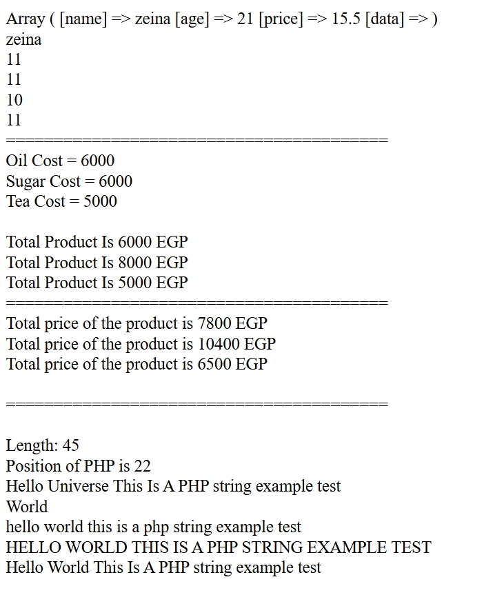
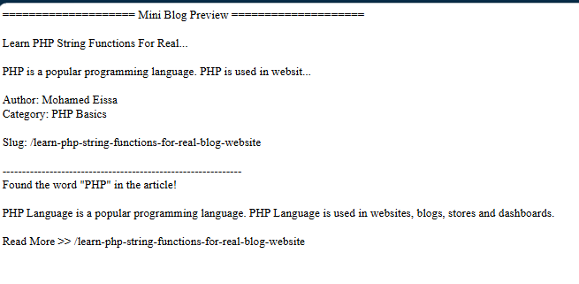
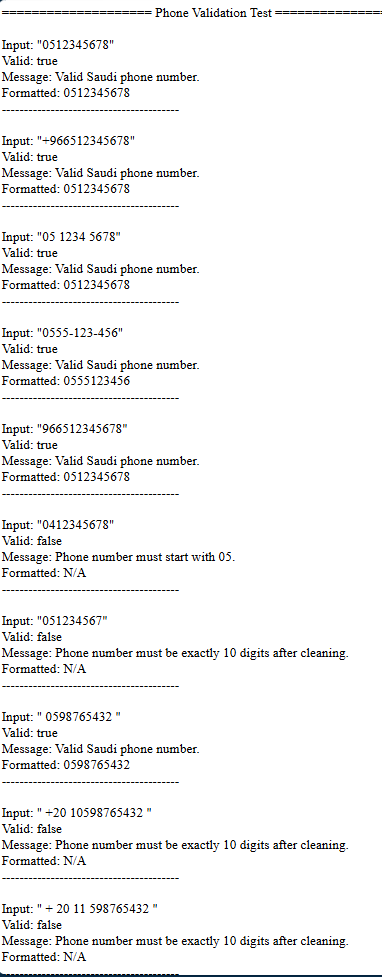

# NTI Full Stack PHP — 2026

Coursework and tasks from the ITIDA–NTI Full Stack Web Development (PHP) summer training program.

## Day 1 — PHP Basics

Practicing PHP fundamentals: arrays, string functions, and basic calculations.

### Task 1 — Mini Blog String Formatter

Formatting a blog post's title, content, author name, and slug using PHP string functions.

### Task 2 — Saudi Phone Number Validator

Validating and standardizing Saudi phone numbers (cleaning, format conversion, length and prefix checks).

---

## Day 3 — HTML & CSS Personal Page

Building a personal profile page using HTML with a blue color palette, featuring personal information, about section, social profiles, and a photo.

### Task Output

### Features
- Personal information section with photo
- About me section
- Navigation links (home, contact us, about)
- Social media profile links
- Blue color palette for a professional look
- Copyright footer

### Technologies Used
- HTML
- Tables for layout (no CSS)
- Blue color scheme (#e8f4f8, #d4e6f1, #1a5276, #2c3e50, #2471a3)

---

## Day 2 — (Coming Soon)

---

## License
© Copyrights are reserved to NTI.